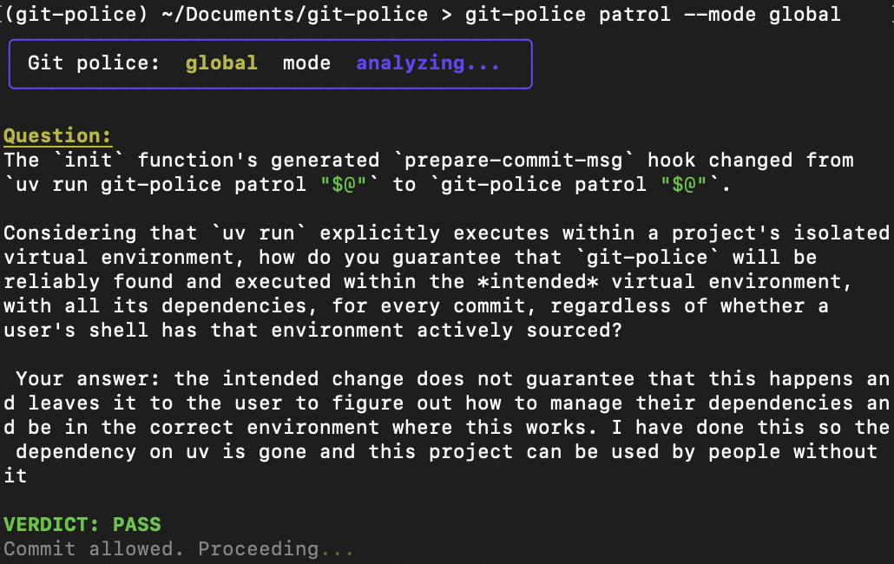

# Git Police

An Anti-AI slop tool that helps prevent slop code from being pushed and allows only the code that you understand to be pushed

# To initialize

```bash
git-police init
```

# To run global (only supports gemini for now)

export a `GEMINI_API_KEY` as an environment variable

```bash
git add .
GIT_POLICE_MODE=global git commit -m "msg"
```

# To run a different ollama model than phi3.5

If you don't have the ollama model
Make sure you have ollama installed in your system

```bash
ollama pull your_model
GIT_POLICE_MODEL="your_model" git commit -m "msg"
```

# You can change Max characters sent to your local model for speed

```bash
MAX_CHAR=int GIT_POLICE_MODEL="your model if not default and not in env" git commit -m "msg"
```

```bash
git add .
GIT_POLICE_MODEL="your_model" git commit -m "msg"
```

# Incase of hallucinations or emergency commits

```bash
git add .
git commit -m "your msg" --no-verify
```

# See it work


