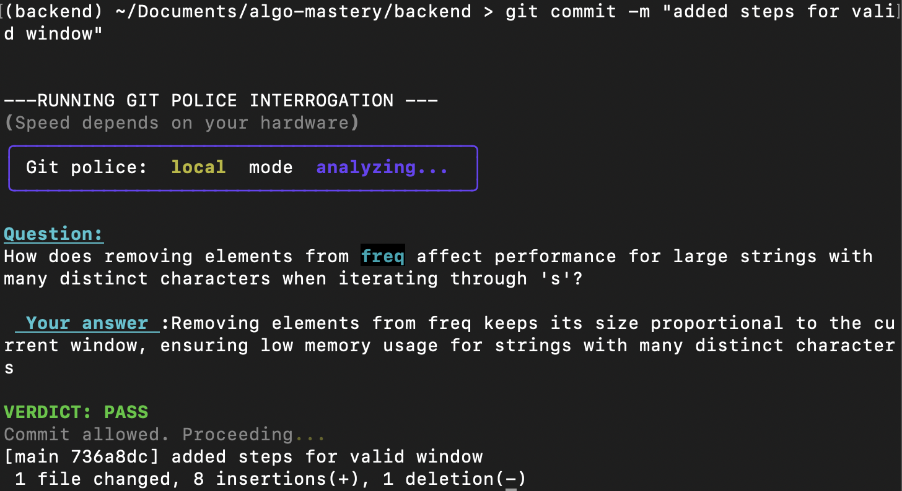

# Git Police

[](https://pepy.tech/projects/git-police)

Git Police is a commit-time assistant designed to prevent low-quality or AI-slop code from being pushed.
It challenges you with a senior-developer style question about your changes and only allows the commit when you demonstrate understanding of the code.

It supports both local models via Ollama and remote evaluation using Gemini.

# Installation

Install inside your virtual environment

```bash
pip install git-police
```

# Initialization

Run once inside a git repository

```bash
git-police init
```

This sets up the Git hook that triggers the code-understanding check before each commit.

# To run global mode (Gemini only)

1. Export your `GEMINI_API_KEY`

```bash
export GEMINI_API_KEY="your_api_key"
```

2. Run a commit with global mode enabled

```bash
GIT_POLICE_MODE=global git commit -m "msg"
```

# To run a different Ollama model

By default, Git Police uses phi4-mini:latest.
To use a different local model:

1. Ensure you have ollama in your system
2. pull the model you want to use
3. Commit using the model

# You can either use

```bash
GIT_POLICE_MODEL="your_model" git commit -m "msg"
```

To use the model

# Or set it up once

```bash
export GIT_POLICE_MODEL="your_model"
```

and now you can commit as normal and it will use your specified model

# Adjusting Maximum Characters Sent to the Local Model

If you want faster responses from your local model, you can reduce the number of characters sent:

```bash
MAX_CHAR=5000 GIT_POLICE_MODEL="your_model" git commit -m "msg"
```

Adjust `MAX_CHAR` as needed

# Bypassing the Check (Emergency Commits)

If you encounter hallucinations or need to bypass Git Police temporarily:

```bash
git commit -m "your msg" --no-verify
```

# Example

See git-police in action


